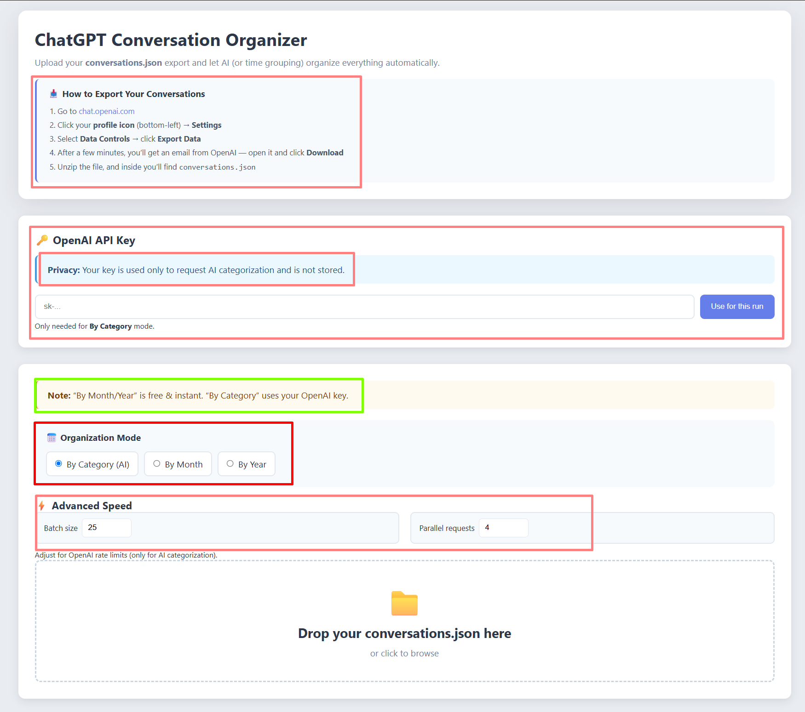
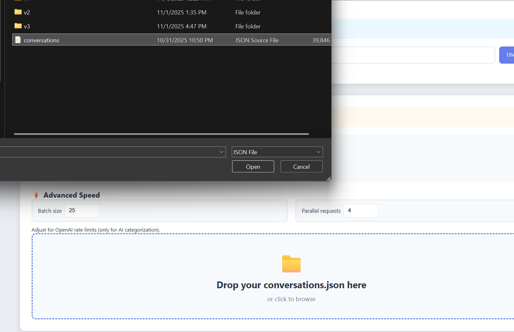
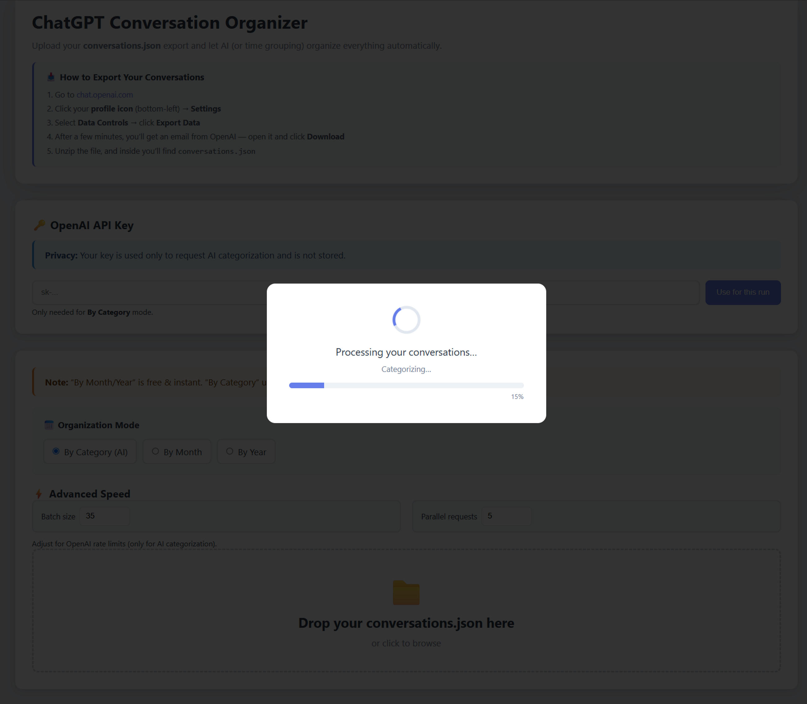
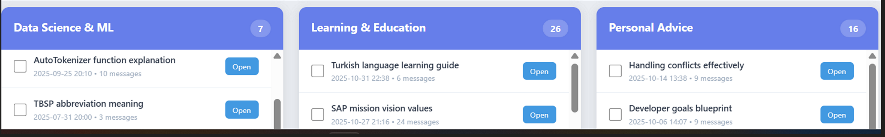

# ChatGPT Conversation Organizer

ChatGPT Conversation Categorizer is a Flask-based web application that helps you analyze and organize ChatGPT conversation exports automatically using GPT-4.

Upload your conversations.json file (exported from ChatGPT), and the app will:

- Categorize each chat into meaningful topics (e.g. “Coding Help,” “Creative Writing,” “Research Notes,” etc.) using OpenAI’s GPT API

- Group conversations by date or topic for better insights into your ChatGPT usage patterns

- Run background processing so large exports (hundreds of chats) are handled efficiently with progress tracking

- Allow custom category sets — define your own labels and the model will assign each chat accordingly

- View progress and results in real-time with a responsive front-end progress bar and detailed logs

- Secure access via short-lived API keys and per-session tokens

The app is designed as a reporting tool for anyone who wants to make sense of their growing ChatGPT history.
It uses a background job system for scalable processing and gracefully handles large exports with retry logic and clear feedback.

## Screenshots

Happy Path







Result - AI Based Categorization



Result - Month based Categorization


## Prerequisites

Before running the application, make sure you have the following installed and configured:

System Requirements

- Python 3.10+

- pip or pipenv for dependency management

- git (optional, if you clone the repo directly)

Python Dependencies

Install all dependencies via:

- pip install -r requirements.txt


The key packages used include:

- Flask – Web framework

- Flask-Limiter – Rate limiting middleware

- Flask-Executor – Background job management

- OpenAI – GPT API client

- python-dotenv – Environment configuration

## OpenAI API Access

You’ll need an OpenAI API key with GPT-4 access (the free ChatGPT plan alone won’t work).
- You can create one at https://platform.openai.com/api-keys

## Structure

- `app/__init__.py` – app factory, CORS, **Flask-Limiter** init
- `app/routes/api.py` – `/api/*` endpoints (**with per-route limits**)
- `app/services/` – jobs, time grouping, categorizer, in-memory store
- `app/utils/keys.py` – Fernet key management
- `app/extensions.py` – shared limiter object
- `app/templates/index.html` – HTML
- `app/static/css/style.css` – CSS
- `app/static/js/app.js` – JS
- `tests/` – pytest suite

## Run locally

```bash
python -m venv .venv && source .venv/bin/activate
pip install -r requirements.txt
python run.py
# http://localhost:5000
```

### Environment
Create a `.env` (optional) based on `.env.example`. Relevant vars:
- `RATELIMIT_DEFAULT` (e.g., `10 per second`)
- `RATELIMIT_STORAGE_URI` (`memory://` by default)
- `CORS_ORIGINS`, `SECRET_KEY`, `HOST`, `PORT`

## Testing

```bash
pip install -r requirements.txt
pip install pytest
python -m pytest tests/
```

