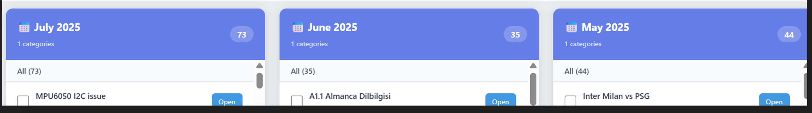

# ChatGPT Conversation Organizer

A web-based tool that helps you organize your ChatGPT conversation history using AI-powered categorization or time-based grouping. Upload your exported conversations and get them automatically sorted into meaningful categories or time periods.


## Screenshots

#### - Happy Path


#### - Result - AI Based Categorization


#### - Result - Month based Categorization



## ✨ Features

- **AI-Powered Categorization**: Uses OpenAI's GPT-4o-mini to intelligently categorize conversations
- **Time-Based Organization**: Group conversations by month or year without needing an API key
- **Privacy-Focused**: API keys are encrypted and only stored temporarily in memory
- **Batch Processing**: Efficient processing with configurable batch sizes and concurrency
- **Visual Dashboard**: Clean, intuitive interface to view and manage your conversations
- **Progress Tracking**: Mark conversations as completed and track your organization progress
- **Search Functionality**: Quickly find conversations by title
- **Export Results**: Download your organized data as JSON

## Quick Start

### Prerequisites

- Python 3.8 or higher
- pip (Python package manager)
- An OpenAI API key (only required for AI categorization mode)

### Installation

1. **Clone the repository**
   ```bash
   git clone <repository-url>
   cd chatgpt-organizer
   ```

2. **Install dependencies**
   ```bash
   pip install -r requirements.txt
   ```

3. **Run the application**
   ```bash
   python run.py
   ```

4. **Open your browser**
   Navigate to `http://localhost:5000`

## Usage

### Step 1: Export Your ChatGPT Conversations

1. Go to [chat.openai.com](https://chat.openai.com)
2. Click your profile icon (bottom-left) → **Settings**
3. Select **Data Controls** → click **Export Data**
4. Wait for the email from OpenAI (usually a few minutes)
5. Download and unzip the file to find `conversations.json`

### Step 2: Choose Organization Mode

**By Category (AI-Powered)**
- Uses OpenAI's API to intelligently categorize conversations
- Requires an API key
- Best for semantic organization

**By Month/Year**
- Groups conversations by creation date
- No API key required
- Free and instant
- Best for chronological organization

### Step 3: Upload and Organize

1. If using AI categorization, enter your OpenAI API key and click "Use for this run"
2. Drag and drop your `conversations.json` file or click to browse
3. Wait for processing to complete
4. Browse your organized conversations!

## Configuration

### Environment Variables

Create a `.env` file in the project root:

```env
# Flask Configuration
SECRET_KEY=your-secret-key-here
HOST=0.0.0.0
PORT=5000

# Rate Limiting
RATELIMIT_DEFAULT=10 per second
RATELIMIT_STORAGE_URI=memory://

# CORS (for production)
CORS_ORIGINS=https://yourdomain.com

# Encryption Key (optional - auto-generated if not provided)
SERVER_ENC_KEY=your-fernet-key-here
SERVER_ENC_KEY_PATH=/path/to/server_secret.key
```

### Advanced Settings

**Batch Size** (5-100)
- Number of conversations processed per API request
- Higher = faster but more tokens per request
- Default: 25

**Parallel Requests** (1-8)
- Number of concurrent API requests
- Adjust based on your OpenAI rate limits
- Default: 4

### Custom Categories

You can define custom categories by modifying the `default_categories` list in `chatgpt_categorizer.py`:

```python
self.default_categories = [
    'Your Category 1',
    'Your Category 2',
    # ... add more
]
```

## Project Structure

```
chatgpt-organizer/
├── app/
│   ├── __init__.py           # Flask app factory
│   ├── config.py             # Configuration settings
│   ├── extensions.py         # Flask extensions
│   ├── routes/
│   │   └── api.py            # API endpoints
│   ├── services/
│   │   ├── chatgpt_categorizer.py  # AI categorization logic
│   │   ├── jobs.py           # Background job processing
│   │   ├── store.py          # In-memory data storage
│   │   └── time_grouping.py  # Time-based organization
│   ├── utils/
│   │   └── keys.py           # Encryption utilities
│   ├── static/
│   │   ├── css/
│   │   │   └── style.css     # Styles
│   │   └── js/
│   │       └── app.js        # Frontend logic
│   └── templates/
│       └── index.html        # Main interface
├── run.py                    # Application entry point
├── requirements.txt          # Python dependencies
└── README.md                 # This file
```

## Security Features

- **Encrypted API Key Storage**: Uses Fernet symmetric encryption
- **Temporary Key Storage**: Keys expire after 10 minutes
- **No Persistent Storage**: API keys never written to disk
- **Rate Limiting**: Protection against abuse
- **Content Security Policy**: Prevents XSS attacks
- **Input Validation**: Sanitizes all user inputs
- **Error Sanitization**: Prevents sensitive data leaks in error messages

## API Endpoints

### POST `/api/register-key`
Register an OpenAI API key for temporary use.

**Request:**
```json
{
  "api_key": "sk-..."
}
```

**Response:**
```json
{
  "key_token": "temporary-token",
  "ttl_seconds": 600
}
```

### POST `/api/categorize`
Start a categorization job.

**Headers:**
- `X-Key-Token`: Required for category mode

**Form Data:**
- `file`: conversations.json file
- `organize_mode`: "category" | "month" | "year"
- `batch_size`: 5-100 (optional)
- `max_concurrency`: 1-8 (optional)

### GET `/api/progress/<job_id>`
Check job progress.

### GET `/api/result/<job_id>`
Retrieve completed job results.

## Development

### Running in Development Mode

```bash
export FLASK_ENV=development
python run.py
```

### Running Tests

```bash
pytest tests/
```

### Code Style

This project follows PEP 8 guidelines. Format your code with:

```bash
black app/
flake8 app/
```

## How It Works

1. **Upload**: User uploads `conversations.json` export
2. **Registration**: (Category mode only) API key is encrypted and stored temporarily
3. **Processing**: 
   - Conversations are batched
   - Each batch is sent to OpenAI's API with categorization prompt
   - Or grouped by creation date for time-based modes
4. **Progress**: Real-time updates via polling
5. **Results**: Organized conversations displayed in dashboard
6. **Tracking**: Users can mark conversations as completed

## Contributing

Contributions are welcome! Please feel free to submit a Pull Request.

1. Fork the repository
2. Create your feature branch (`git checkout -b feature/AmazingFeature`)
3. Commit your changes (`git commit -m 'Add some AmazingFeature'`)
4. Push to the branch (`git push origin feature/AmazingFeature`)
5. Open a Pull Request

## License

This project is licensed under the MIT License - see the LICENSE file for details.

## !! IMPORTANT Notes

- **API Costs**: Using AI categorization consumes OpenAI API credits. Monitor your usage at [platform.openai.com](https://platform.openai.com/usage)
- **Rate Limits**: Adjust batch size and concurrency based on your OpenAI account tier
- **Data Privacy**: Your conversation data is processed locally and only summaries are sent to OpenAI's API
- **Browser Storage**: Progress tracking uses localStorage - clearing browser data will reset completion status

## FAQ

**Q: How much does AI categorization cost?**
A: Costs vary based on conversation count. Typical exports with 100-500 conversations cost $0.10-$0.50 using GPT-4o-mini.

**Q: Is my data stored on the server?**
A: No. Files are processed in temporary storage and deleted immediately after processing. API keys are never persisted.

**Q: Can I organize conversations multiple times?**
A: Yes! Upload the same file with different modes or categories as many times as you need.

**Q: Why aren't my conversations loading?**
A: Ensure your JSON file is a valid ChatGPT export. Check the browser console for errors.

**Q: Can I run this on a server?**
A: Yes! Configure the HOST and PORT environment variables for deployment. Consider using Gunicorn or uWSGI for production.

## Support

For issues, questions, or suggestions:
- Open an issue on GitHub
- Check existing issues for solutions
- Review the FAQ section above

## Acknowledgments

- Built with Flask and OpenAI's GPT-4o-mini
- Inspired by the need to organize years of ChatGPT conversations
- Thanks to the open-source community for excellent tools and libraries